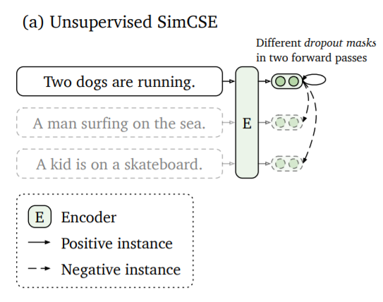

# Система хранения для RAG

## ТЗ

> [!TIP] 
> **Разработать систему хранения информации для RAG**: Есть PDF документ, необходимо по нему сформировать индекс в какой-нибудь векторной бд для последующего использования в RAG'е. Предполагается, что подобных документов может быть больше чем один. Содержание документов может меняться - соответсвенно в индексе должна лежать актуальная информация относительно текущего состояния документов. **Дополнительно**: Проработать варианты дообучения моделей поиска/ранкинга на основе структуры предоставленного документа.

## Запуск

> [!warning]
> Необходимо установить Docker

1. Клонируем репозиторий
2. Загружаем БД **Milvus** и запускаем через **Docker Compose** 
```cmd
D:\information_storage_system_for_RAG>Invoke-WebRequest https://github.com/milvus-io/milvus/releases/download/v2.4.15/milvus-standalone-docker-compose.yml -OutFile docker-compose.yml

D:\information_storage_system_for_RAG>docker compose up -d
Creating milvus-etcd  ... done
Creating milvus-minio ... done
Creating milvus-standalone ... done
```

3. Устанавливаем зависимости
```cmd
pip install -r requirements.txt
```

4. Запускаем **retriever_service**

```cmd
cd retriever_service; uvicorn main:app --port 8000
```

5. Запускаем **api_gateway**

```cmd
cd api_gateway; uvicorn main:app --port 8001
```

6. Используем **Swagger** для отладки
	1. api_gateway - http://127.0.0.1:8001/docs
	2. retriever_service - http://127.0.0.1:8000/docs

7. (Пока в работе!) Можно запустить весь проект через **Docker-compose** 
```cmd
docker compose up -d
docker compose -f docker-compose_app.yml up --build
```

## Fine-Tuning Retriver 

Для Fine-Tuning retrivera использовался метод [SimCSE](https://sbert.net/examples/sentence_transformer/unsupervised_learning/SimCSE/README.html "SimCSE")



> [!note]
> Пример дообучения находится в файле `train_retriver.ipynb` 

> [!note]
> После обучения необходимо в сервисе **retriever_service** передать **checkpoint** новой модели
